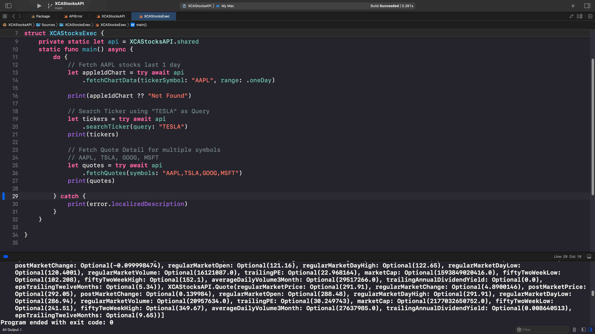

# XCAStocksAPI


This library provides very simple and Swiftly way to interact with Yahoo Finance REST API.

## Features
- Fetch Chart data for 1d, 1w, 1mo, 3mo, 6mo, 1y, 2y, 5y, YTD, max.
- Search Ticker using query.
- Fetch quotes using ticker symbols.
- Swift Async Await Interface.
- Fetch Raw JSON data.

### Swift Package Manager

- File > Swift Packages > Add Package Dependency
- Add https://github.com/alfianlosari/XCAStocksAPI.git
- Select "Main" branch

## Example

### Initialize repository

First of all, you need to import and initalize the `XCAStocksAPI`.

```swift
import XCAStocksAPI

let api = XCAStocksAPI()
```

### Fetch AAPL stocks last 1 day
```swift
let apple1dChart = try await api.fetchChartData(tickerSymbol: "AAPL", range: .oneDay)
```

### Search Ticker using "TESLA" as Query
```swift
let tickers = try await api.searchTicker(query: "TESLA")
```

### Fetch Quote Detail for multiple symbols AAPL, TSLA, GOOG, MSFT
```swift
let quotes = try await api.fetchQuotes(symbols: "AAPL,TSLA,GOOG,MSFT")
```

### Powered by Yahoo Finance API
https://www.yahoo.com/?ilc=401
